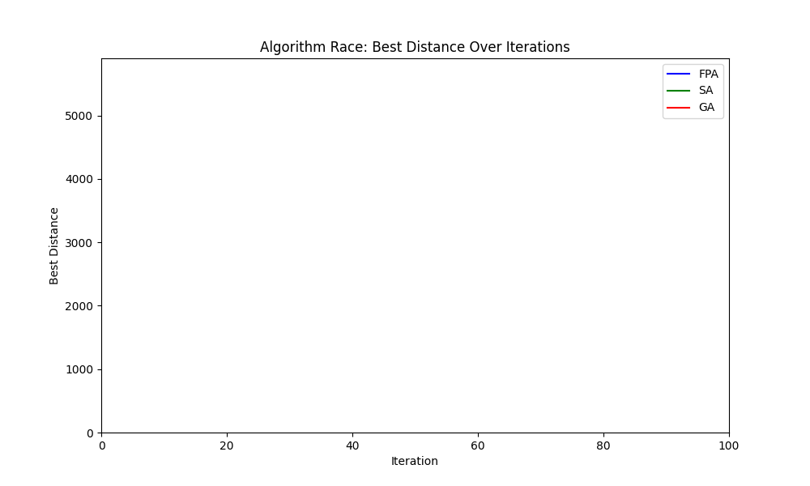

# Traveling Salesman Problem Optimization for Tunisian Cities

This project demonstrates the application of metaheuristic optimization algorithms to solve the Traveling Salesman Problem (TSP) for a set of Tunisian cities. The goal is to find the shortest possible route that visits each city exactly once and returns to the starting city.

## Context

The TSP is a classic combinatorial optimization problem with applications in logistics, routing, and planning. In this project, the TSP is solved for 25 major cities in Tunisia, using their geographical coordinates.

Three algorithms are implemented and compared:
- **Flower Pollination Algorithm (FPA)**
- **Simulated Annealing (SA)**
- **Genetic Algorithm (GA)**





The project includes:
- Python implementations of all algorithms, using a consistent distance calculation based on city coordinates.
- Visualization of routes and convergence using Matplotlib and Folium.
- A Streamlit web app for interactive experimentation and comparison of algorithms.
- Animated comparison of algorithm progress.

## Features

- **Consistent Distance Calculation:** All algorithms use a symmetric distance matrix computed from city coordinates (Euclidean distance scaled to kilometers).
- **Interactive Web App:** Users can run and compare algorithms, visualize routes, and analyze performance metrics.
- **Visualization:** Both static and animated visualizations of routes and algorithm convergence.
- **No Sensitivity Analysis Tab:** The Streamlit app focuses on algorithm runs and result comparison, omitting parameter sensitivity analysis for simplicity.

## Usage

- Run the Streamlit app (`app.py`) to interactively solve and visualize the TSP.
- Use the notebook (`fpa.ipynb`) for step-by-step exploration and analysis.

## Files

- `algorithms.py`: Core algorithm implementations and city data.
- `app.py`: Streamlit web application.
- `main.py`: Script for running and animating all algorithms side by side.
- `fpa.ipynb`: Jupyter notebook for analysis and visualization.

## Dependencies

The project requires the following Python libraries:
- `streamlit`
- `matplotlib`
- `numpy`
- `scipy`
- `folium`
- `streamlit-folium`

Install the dependencies using:
```bash
pip install -r requirements.txt
```

## How to Run

1. Clone the repository:
   ```bash
   git clone <repository-url>
   cd FPA
   ```

2. Install the dependencies:
   ```bash
   pip install -r requirements.txt
   ```

3. Run the Streamlit app:
   ```bash
   streamlit run app.py
   ```

4. Open the provided URL in your browser to interact with the dashboard.

## License

This project is licensed under the MIT License. See the `LICENSE` file for details.

## Acknowledgments

- **Streamlit**: For building interactive dashboards.
- **Folium**: For map visualizations.
- **Matplotlib**: For dynamic plotting.
- **Scipy**: For implementing the Levy flight distribution in FPA.
